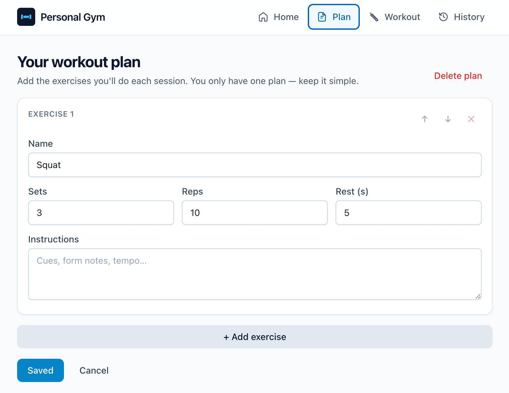

# Personal Gym

A web-based **Personal Exercise Gym Instructor** that guides you through home workouts step by step — set by set, with auto-timed rests, and a complete history of every session. Everything is stored locally on your device; no account or network connection required.



Built as a Progressive Web App so you can install it on your phone or desktop and use it offline.

> See [`masterplan.md`](./masterplan.md) for the full product spec and [`future-enhancements.md`](./future-enhancements.md) for the roadmap beyond the MVP.

---

## Features (MVP)

- **Single workout plan editor** — add, edit, reorder, and remove exercises. Each exercise stores a name, sets, reps, instructions, and a default rest time.
- **Guided workout sessions** — the app walks you through each set of each exercise in order, with a countdown rest timer between sets (skippable).
- **Workout history** — a date-stamped list of completed sessions with a per-set breakdown of reps.
- **Offline-first PWA** — installable, works without an internet connection once loaded.
- **Mobile, tablet, and desktop** — responsive single-column layout on phones, wider two-column-friendly layout on larger screens.

---

## Tech stack

| Layer | Choice |
| --- | --- |
| Frontend | React 18 + React Router |
| Styling | Tailwind CSS |
| Build tool | Vite |
| Local storage | IndexedDB via Dexie.js |
| PWA / offline | `vite-plugin-pwa` (Workbox) |
| Unit tests | Vitest + React Testing Library |
| End-to-end tests | Playwright |

All data lives in your browser's IndexedDB. No server, no telemetry, no accounts.

---

## Getting started

### Prerequisites

- **Node.js 18+** (developed on Node 24)
- npm 9+

### Install

```bash
npm install
```

### Run the dev server

```bash
npm run dev
```

The app is served at `http://localhost:5173` with hot-module reload.

### Build for production

```bash
npm run build
```

The production bundle (including the PWA service worker and manifest) is written to `dist/`. Serve it with any static host.

### Preview the production build locally

```bash
npm run preview
```

This serves the contents of `dist/` at `http://localhost:4173` so you can sanity-check the build before deploying.

---

## Testing

### Unit tests (Vitest)

```bash
npm test           # run once
npm run test:watch # watch mode
```

Unit tests live in `src/test/`. The IndexedDB data layer is mocked so tests run in jsdom without a real database.

### End-to-end tests (Playwright)

The e2e suite runs the **production build** against real Chromium. Each test starts with a clean IndexedDB + service-worker state.

The single command for the full flow — **build, serve, test, generate report**:

```bash
npm run test:e2e:full
```

That runs:

1. `npm run build` — fresh production bundle.
2. `start-server-and-test` starts `npm run preview` and waits for it to respond.
3. `playwright test --reporter=list,html` runs the suite.
4. Preview server is shut down on exit.
5. HTML report is written to `playwright-report/index.html`.

To open the report:

```bash
npx playwright show-report
```

Other e2e commands:

| Script | Description |
| --- | --- |
| `npm run test:e2e:full` | Build + serve + test + HTML report (recommended). |
| `npm run test:e2e` | Run Playwright against an already-running preview (advanced). |
| `npm run test:e2e:ui` | Open Playwright's interactive test runner. |
| `npm run test:e2e:headed` | Run Playwright with a visible browser window. |
| `npm run e2e:install` | Install Playwright browsers (one-time, on a fresh machine). |

### Run everything

```bash
npm run test:all
```

This runs the unit tests followed by the full e2e flow (build + serve + tests + HTML report).

---

## Deployment to GitHub Pages

The app is a static PWA — there is no server. It's set up to deploy to a GitHub Pages **project site** at `https://<your-username>.github.io/personal-gym/`.

### One-time setup

1. Push the repository to GitHub.
2. In the repository settings → **Pages**, set the source to **GitHub Actions** (not "Deploy from a branch").
3. Make sure the default branch is `main` (or update `.github/workflows/deploy.yml` to match).

That's it. From now on, every push to `main` builds and deploys automatically.

### How it works

- **Vite `base`** is set to `/personal-gym/` in `vite.config.js`, so all emitted asset URLs include the project-site path. This is what makes the bundle work under the `/personal-gym/` URL.
- **PWA manifest** uses the same path for `start_url` and `scope`, so the installed PWA opens at the right place.
- **React Router** reads `import.meta.env.BASE_URL` and uses it as its `basename`, so `<Link to="/plan">` resolves to `/personal-gym/plan`.
- **SPA 404 fallback**: a tiny Vite plugin copies `index.html` to `404.html` during build. GitHub Pages serves `404.html` for any unknown route; React Router then takes over from the URL.
- **Service worker** is scoped to `/personal-gym/` so it can control pages under that path.

The workflow lives in [`.github/workflows/deploy.yml`](./.github/workflows/deploy.yml) and uses the official `actions/deploy-pages` action.

### Local preview of the production build

```bash
npm run preview
```

Vite's preview server respects the configured `base`, so it'll serve the app at `http://localhost:4173/personal-gym/` — same path shape as the deployed site. This is exactly what the e2e suite exercises.

### Switching to a user/org site

If you ever publish under a custom domain or a user/org site (e.g. the repo is renamed to `<your-username>.github.io`), change the `BASE` constant in `vite.config.js` to `'/'`.

---

## Project structure

```
personal-gym/
├─ public/                 # Static assets copied as-is (favicon, PWA icons)
├─ src/
│  ├─ components/layout/   # Persistent Layout shell (header + bottom-nav)
│  ├─ context/             # React Context providers: Plan, History, Session
│  ├─ data/                # Dexie db, plan + history repositories, model helpers
│  ├─ pages/               # Top-level routed views
│  │  ├─ HomePage.jsx
│  │  ├─ PlanEditorPage.jsx
│  │  ├─ WorkoutSessionPage.jsx
│  │  ├─ HistoryPage.jsx
│  │  └─ HistoryDetailPage.jsx
│  ├─ test/                # Vitest unit tests
│  ├─ App.jsx              # Route definitions
│  ├─ main.jsx             # Entry; registers the PWA service worker
│  └─ index.css            # Tailwind layers + a small set of component classes
├─ e2e/
│  └─ smoke.spec.js        # Playwright e2e tests
├─ playwright.config.js
├─ vite.config.js          # Vite + PWA + Vitest config
├─ tailwind.config.js
├─ postcss.config.js
├─ index.html
└─ package.json
```

---

## How it works

### Data model

There is exactly **one active workout plan** at a time, identified by the constant `'active'` in IndexedDB. The plan holds a flat list of exercises; each exercise has a name, sets, reps, instructions, a default rest duration, and a stable order.

When a workout session finishes, a snapshot of the plan (so future edits don't change history) plus a list of completed sets is written to the `sessions` store.

### Guided session flow

`WorkoutSessionPage` runs a small state machine in the `SessionContext`:

1. `ready` — the user can start a workout (or sees a "no plan" guard).
2. `in-progress` — they see the current exercise and set, mark a set complete.
3. `resting` — full-screen countdown, skippable.
4. `summary` — totals, then redirect to history.

The rest timer is driven from `Date.now()` (rather than incrementing a counter) so it stays accurate when the browser tab is throttled in the background.

### Why PWA?

The app is intentionally a single deployable web bundle. A PWA gives us:

- install on the home screen, with no app store review,
- offline support via a service worker,
- one codebase that works on Chrome, Safari, Edge, and Firefox across phone, tablet, and desktop.

---

## Browser support

The app targets evergreen browsers:

- Chrome / Edge (Chromium) — full support, including PWA install.
- Firefox — full functionality; PWA install flow is browser-dependent.
- Safari (iOS 16.4+, macOS) — full functionality; "Add to Home Screen" installs the PWA manually (Safari does not surface the auto-install prompt).

---

## Privacy

This is a **local-only** app. There are no network requests for core functionality and no analytics. All workout data lives in your browser's IndexedDB. See the masterplan's "Security Considerations" section for the rationale.

Some mobile browsers may clear IndexedDB under storage pressure — keep an eye on the "Future Enhancements" document for export/import work that will let you back up your data.

---

## License

ISC (or whatever license you prefer — add it here).
